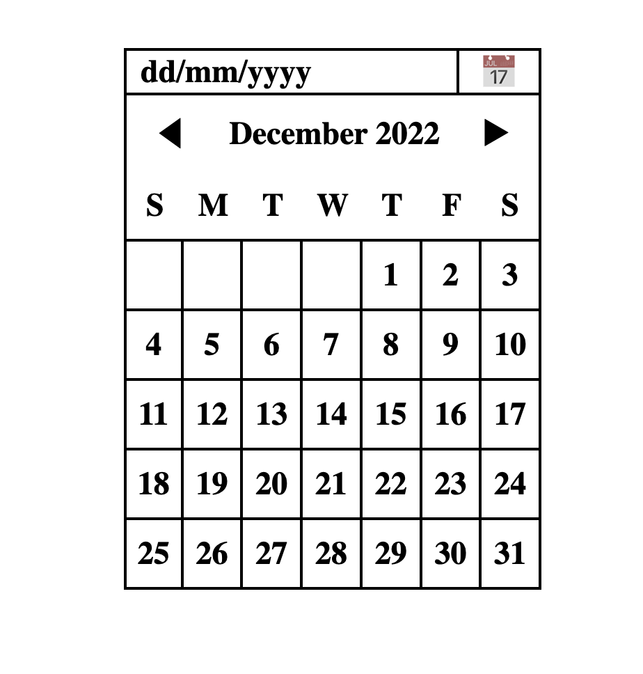

# 📅 CSS Calendar Grid Project

A static calendar UI built using only **HTML and CSS**, with a focus on learning **CSS Grid**, **Flexbox**, and layout techniques.

---

## 🚀 Overview

This project is a minimalist calendar layout styled with CSS Grid. It was completed in under 3 hours as a speed-learning challenge to improve my understanding of positioning and box model concepts.

---

## 🎯 Objectives

- Build a calendar layout using **only HTML and CSS**
- Practice and apply **CSS Grid** concepts
- Learn layout debugging and positioning strategies
- Explore responsive alignment and visual consistency

---

## 🛠️ Features

- ✅ Fully structured grid with 7 columns and 6 rows
- ✅ Weekday labels and day numbers
- ✅ Centered content using Flexbox
- ✅ Consistent borders with edge-case handling
- ✅ Minimal, responsive-friendly foundation

---

## 🧠 What I Learned

- CSS Grid fundamentals (`repeat()`, `grid-template-columns`, `grid-template-rows`)
- `nth-child()` tricks to style grid-specific borders
- Flexbox for vertical and horizontal centering
- Importance of mental state and timing in learning absorption
- That sometimes a looming battery death and a full bladder can be surprisingly motivational 😄

---

## 📸 Screenshot

>  

---

## 🔗 Original Project Brief

> _Paste link to the original brief or challenge here (e.g. Notion, Figma, PDF)_  
> Format:  
> https://roadmap.sh/projects/datepicker-ui

---

## 🧩 Technologies Used

- HTML5
- CSS3 (Grid, Flexbox, Box Model)

---

## 📂 Folder Structure

```plaintext
├── index.html
├── styles.css
├── README.md
└── screenshot.png (optional)

📝 Future Improvements
Add responsiveness for smaller screens

Dynamically populate the calendar using JavaScript

Add support for switching months/years

Accessibility improvements (ARIA, keyboard navigation)

🧑‍💻 Author
Joshua Agbor
Web dev explorer & creative systems builder
